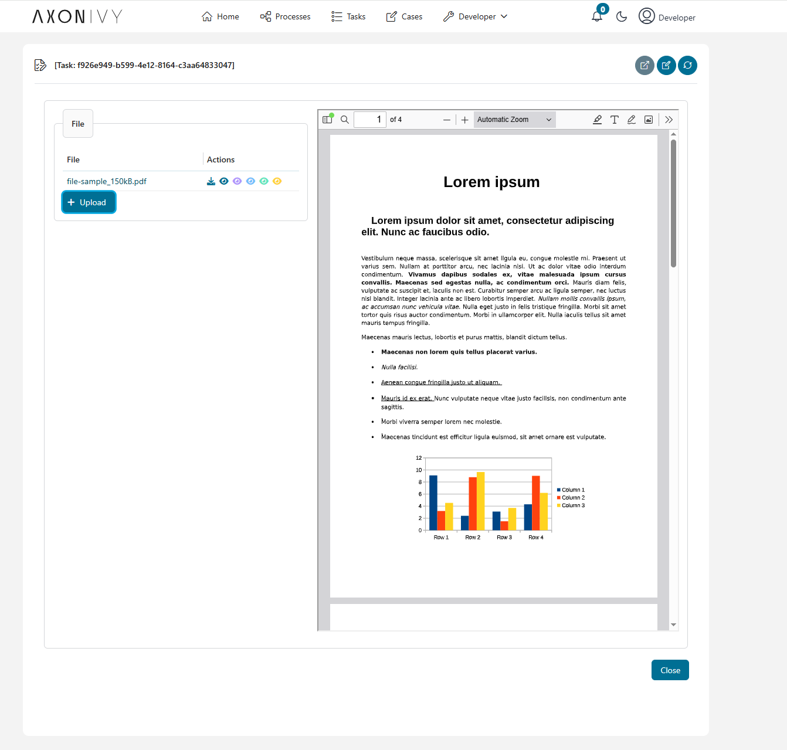

# PDF Viewer #

JSF support many kind of view like `pe:documentViewer`, `p:media`. Beside that we can use `iframe` or web browser to view pdf file

## How to implement? ##

### 1. Using `pe:documentViewer` with `org.primefaces.model.StreamedContent` ###
```html
<pe:documentViewer value="#{data.fileContent}" download="Download file name" width="100%" height="100%" />
```

```java
InputStream inputStream = new FileInputStream(file.getJavaFile());
StreamedContent fileContent = DefaultStreamedContent.builder().name(file.getName()).stream(() -> inputStream).build();
```

>[!IMPORTANT]
> We need to define variable in Data class and use in on xhmtl
> 

### 2. Using `pe:documentViewer` with `ch.ivyteam.ivy.scripting.objects.File` url ###
```java
this.url = Ivy.html().fileLink(file).toAbsoluteUri().toString();
```
```html
<pe:documentViewer value="#{data.ctrl.url}" download="Download file name" width="100%" height="100%" />
```

### 3. Using `iframe` with url link ###
With iframe, it only support view pdf file from url.
```html
<iframe src="#{data.ctrl.url}" name="Download file name" width="100%" height="100%" />
```
										
### 4. Using file url in  `h:outputLink` ###
```html	
<h:outputLink value="#{ivy.html.fileLink(file).toAbsoluteUri()}" target="_blank"> #{file.name} </h:outputLink>
```
>[!NOTE]
>target="_blank" to open new tab

										
### 5. Using file url in  `p:media` ###
```html	
<p:media value="#{data.ctrl.url}" width="100%" height="100%" />

```

### 6. Using an api link to get file content and embeded it in any pdf viewer component above ###
```java	
String apilink = Ivy.html().applicationHomeLink().getAbsolute()
this.url = String.format("%s/api/appservices/file/%s", aplink, file.getName());


// Handle api 
@Path("appservices/file")
public class FileController {

	@GET
	@Path("/{fileName}")
	@Consumes(MediaType.APPLICATION_JSON)
	@Produces({ MediaType.APPLICATION_OCTET_STREAM, MediaType.APPLICATION_JSON })	
	public Response getQueryDocumentContent(@PathParam("fileName") String filename) {
			
		if (isEmpty(filename)) {
			return Response.status(BAD_REQUEST).build();
		}

		try {
			File file = new File(filename);
			InputStream inputStream = new FileInputStream(file.getJavaFile());
			return Response.status(OK).type("application/pdf").entity(inputStream).build();
		} catch (IOException e) {
			Ivy.log().error("Error when reading file {0}", e, filename);
			return Response.status(Status.INTERNAL_SERVER_ERROR).build();
		}
	}
}

```

## Demo ##

